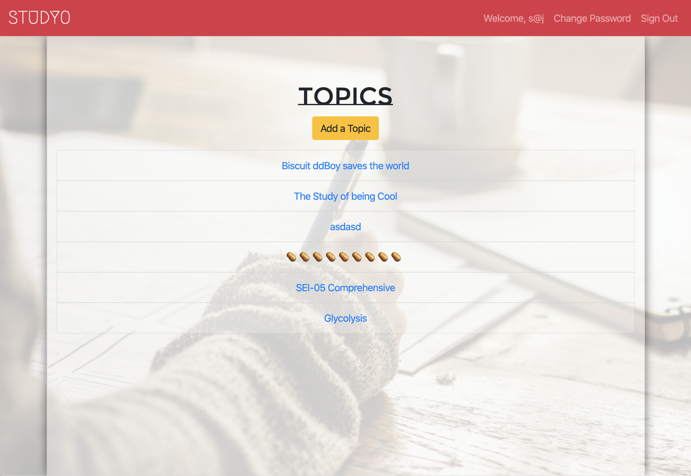
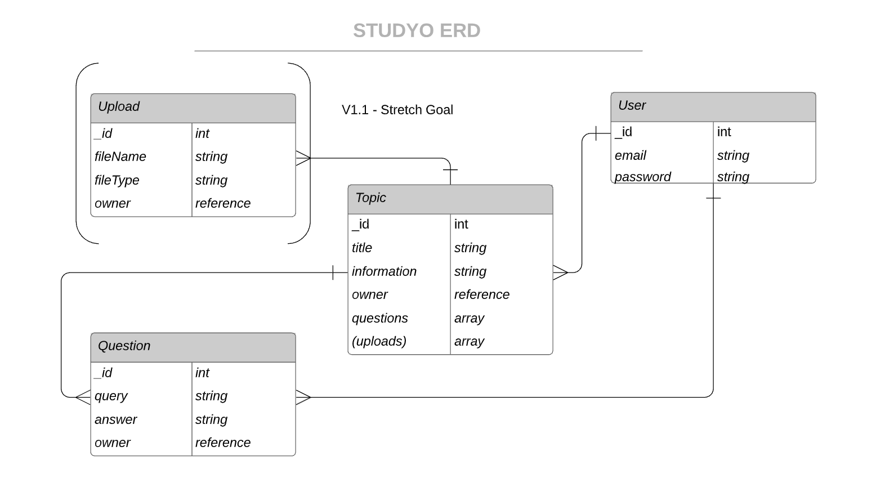

# STUDYO

## Let's Study Together

Exam? Presentation? Interview? Just thirsty for knowledge? You can head over to the **STUDYO**! This application allows users to contribute to or learn from a body of knowledge synthesized by _YOU_! Users must create an account or sign in access the Studyo where they are able to create, edit, and delete topics to study. Each topic contains questions to study. Think flash cards, but digital.

**STUDYO**'s API utilizes MongoDB, Mongoose, and Express. Created topics and questions are stored in NoSQL documents.

This is Studyo's back end repository. To view the repository for the Studyo front end, click [here](https://github.com/stanjng/studyo-frontend).

## Links
- [Deployed Application](https://stanjng.github.io/studyo-frontend/)
- [Deployed API via Heroku](https://aqueous-crag-04598.herokuapp.com/)
- [Studyo API](https://stanjng.github.io/studyo-frontend/)

## Technologies
- AWS
- Express
- Heroku
- MongoDB
- Mongoose
- Postman

## The Deployed **STUDYO**

## Setup
1. Fork & Clone or download this repository.
1. Install dependencies with `npm install`
1. Run local server with `nodemon run server`.

## Planning and Development
Mongoose allows for really simple schema creation that is flexible and can be changed in an instant.
Express is similarly flexible because the routes are highly customizable. This project has allowed me to become much more familiar with promise chaining. It has especially bolstered my ability to track down sources of errors and to actually be able to "translate" the code into plain terms to gain a better understanding of what the code is doing.

Particularly challenging routes to create were update and create the child resource (questions).

The API is hosted by Heroku.

The instructional team and my classmates were crucial in my development process to bounce ideas.

## ERD

## Resource Routes
#### USER ROUTES
| HTTP      | CRUD     | URI Pattern   |  Controller#Action |
| ------------- |:-------------:| -----:|-----:|
| POST  | CREATE  | /sign-up | users#signup |
|POST |CREATE |/sign-in |users#signin|
| PATCH | UPDATE | /change-password |  users#changepw|
|  DELETE| DELETE | /sign-out |  users#signout|

#### TOPIC ROUTES
| HTTP      | CRUD     | URI Pattern   |  Controller#Action |
| ------------- |:-------------:| -----:|-----:|
| GET  | READ  | /topics | topics#index |
| GET  | READ  | /topics/:id  | topics#show |
| POST  | CREATE  | /topics | topics#create |
| PATCH | UPDATE | /topics/:id |  topics#update|
|  DELETE| DELETE | /topics/:id |  topics#destroy|

#### QUESTION ROUTES
| HTTP      | CRUD     | URI Pattern   |  Controller#Action |
| ------------- |:-------------:| -----:|-----:|
| GET  | READ  | /topics/questions | topics#index |
| GET  | READ  | /topics/:id/questions/:qid  | topics#show |
| POST  | CREATE  | /topics/:id/questions | topics#create |
| PATCH | UPDATE | /topics/:id/questions/:qid/ |  topics#update|
| DELETE | DELETE | /topics/:id/questions/:qid |  topics#destroy|

## Future Directions
- Implement file uploader.

## Acknowledgements

Thank you to my instructors, fellow software engineer classmates, and friends who keep me grounded and driven.
